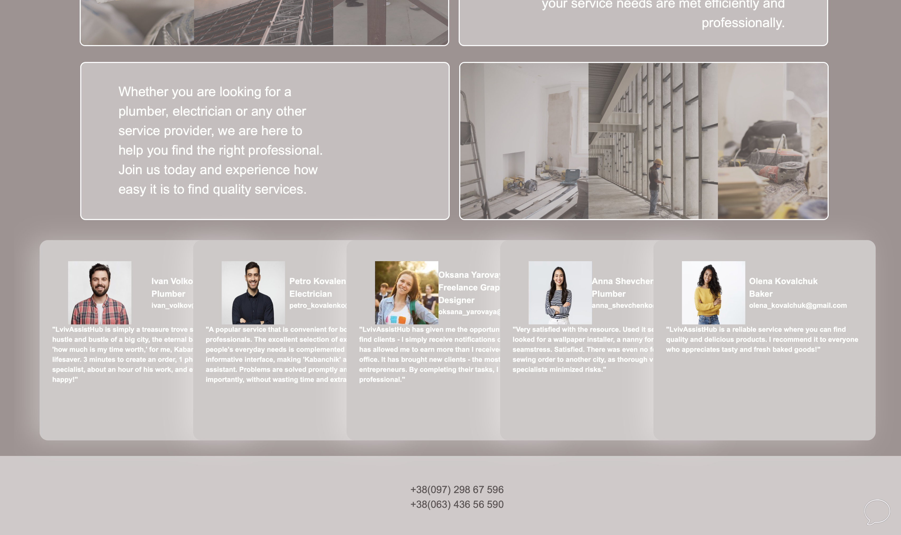

# LvivAssistHub
This app was developed with the goal of streamlining the process of finding skilled professionals who specialize in cleaning ventilation and plumbing systems and other services. By connecting users with qualified individuals or companies, it aims to make the task of maintaining and servicing these essential systems easier and more convenient. Whether you need routine maintenance or urgent repairs, this app provides a platform to find reliable professionals efficiently.
# Homepage
On this page user can sign up or log in by appropriate button in a top bar if he/she is not logged in.

If user is logged in he/she can view his/her profile or log out by aproppriate buttons in a top bar.

Also user can choose the theme of app (which will be authaumatically provide it on other pages and user can change it on other pages with light bulb in the top left corner).

Also user can send us a message by button with message icon.

And finally see about us info, some comments of other users and our phone numbers.

# Sign up page
Here user need to enter name, surname, email and create password.

# Log in page
On this page user can log in app by his/her email and password.

Also the user will be redirected here after signing up, but the page will additionally include flash message about succesfull registration.

# Account page
Here user can upload or change his/her photo. In the top bar the user can find "Add post" button.

# Add post page
On this page user can add post which will be visible to every user. He/She need to enter short description, price and hashtag (user can choose from already existing hashtag or create new).

# Search page
Here user needs to choose the hashtag that is the most suitable to his/her problem.

# Employee Information
On this page user can see all employees that add post with hashtag that user choose.

Or he can see alert message, that unfortunately we do not have any employye with post that will be connected to hashtag user has chosen.
# Employee profile
Here user can see full description and price text that employee provided. Also on this page user can find name, surname, email, photo (if it was uploaded) and comments (that war written by other users) of employee. Also if user is loggid in he/she can left his/her own comment(s) to this employee.

If user is not logged in he/she can only view other comments without an ability to add them.
# Credits
Big thanks to the folks who pitched in to build this website!
